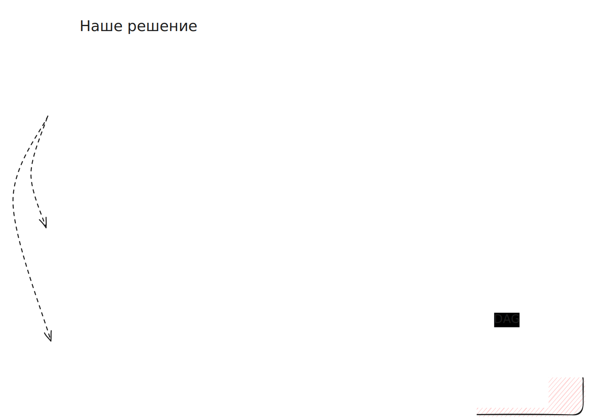

# MCP сервер для LLM агентов

MCP Сервер является сердцем нашего решения. Он предоставляет сервисам LLM Chat и Gitlab Agent возможность взаимодействовать с инфраструктурой, в которй MCP сервер запущен.

На стороне MCP сервера реализовано взаимодействие со следующими объектами:

- Базы данных, все, для которых есть драйвера для `sqlalchemy`
- Файловые хранилища (S3, SMB)
- Kafka

Для файловых хранилищ поддерживаются следующие форматы данных:
- CSV, TSV
- JSON, XML
- Parquet

Основные действия над базами данных:
- проверить доступность
- проверить наличие схемы.таблицы
- получить DDL (структуру таблицы)
- получить sample данных для проверки структуры таблицы

Основные действия над хранилищами
- проверить доступность хранилища
- проверить доступность каталога и проверить наличие файла
- прочитать файл или его часть (для текстовых форматов)
- получить схему для parquet файлов

## Архитектура решения

__Продублировано из репозитория Gitlab Агента__

Агент состоит из двух основных модулей:
- LLM Чат (пользовательский интерфейс)
- LLM Gitlab Агент (сервис)

Также, для работы сервисов необходим MCP сервер с набором инструметов для взаимодействия с базами данных и хранилищами.

Создание нового пайплайна для загрузки данных начинается в чате.
Пользователь в процессе общения с агентом передает все необходимые данные для создания новой загрузки данных.
Агент чата, после сбора необходимых данных, создает в приложении Gitlab issue, где собрана вся информация для создания пайплайна.
После создания issue Gitlab вызывает webhook к LLM Gitlab Агенту и запускает обработку issue. Gitlab Агент обрабатывает issue и создает в репозитории Gitlab в выделенном проекте новую ветку и передает в нее весь созданный код и документацию, создает Merge Request и завершает свою работу.

При принятии Merge Request'a срабатывает cicd по доставке изменений в Airflow.

Связанные проекты:

- MCP Сервер: https://github.com/AnatoliyAksenov/chat-app-mcp
- LLM Chat backend: https://github.com/AnatoliyAksenov/chat-app-backend
- LLM Chat frontend: https://github.com/AnatoliyAksenov/chat-app-frontend
- Gitlab Agent: https://github.com/AnatoliyAksenov/gitlab-agent

Также, мы подготовили развернутый стенд